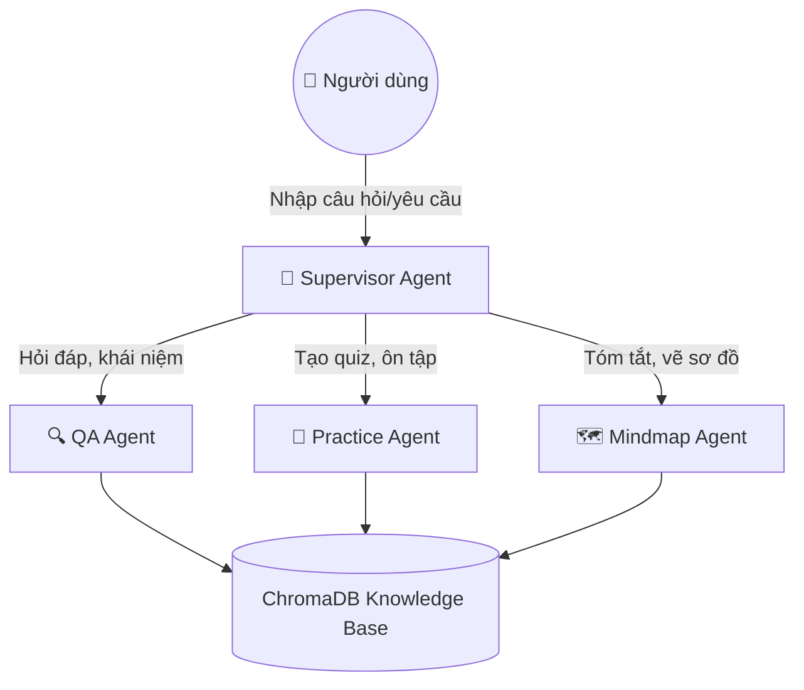

<div align="center">

# 🤖 Hust-Agentic-AI-Group-8
**Multi-Agent AI Study Assistant**

[](https://soict.hust.edu.vn/summer-school-2025)
[](#)
[](#)
[](#)

> **Dự án được phát triển bởi Nhóm 8 trong khuôn khổ chương trình đào tạo Trường Hè HUST Summer School 2025.** <br/>
> Hệ thống trợ lý học tập thông minh tự động phân tích tài liệu, hỗ trợ giải đáp, trắc nghiệm và tạo sơ đồ tư duy trực quan.

</div>

---

## 🌟 Tính năng nổi bật

Hệ thống sử dụng kiến trúc **Multi-Agent** mạnh mẽ với **LangGraph**, nơi một *Supervisor Agent* đóng vai trò điều phối thông minh giữa các Agent chuyên biệt:

* 🔍 **QA Agent:** Phân tích tài liệu và trả lời câu hỏi chuyên sâu với độ chính xác cao.
* 📝 **Practice Agent:** Tự động tạo bộ câu hỏi ôn tập, trắc nghiệm kèm giải thích chi tiết.
* 🗺️ **Mindmap Agent:** Trực quan hóa kiến thức bằng cách tạo sơ đồ tư duy (Mermaid).
* 📄 **Đa nền tảng tài liệu:** Hỗ trợ xử lý thông minh các file `PDF`, `PPTX`, `DOCX`, và `TXT` bao gồm cả hình ảnh (qua OCR/Vision).

---

## 🏗️ Kiến trúc Hệ thống



---

## 🛠️ Công nghệ sử dụng (Tech Stack)

| Thành phần | Công nghệ / Framework |
| :--- | :--- |
| **LLM Core** | `GPT-4.1-nano` (OpenAI) |
| **Vision & Image** | `Gemini 2.5 Flash` (Google) |
| **Embeddings** | `Google Embedding-001` |
| **Vector Database** | `ChromaDB` (Cloud Client) |
| **Agent Framework** | `LangGraph` & `LangChain` |
| **Document Processing**| `PyMuPDF`, `python-pptx`, `python-docx` |

---

## 📦 Hướng dẫn cài đặt

Làm theo các bước sau để chạy hệ thống trên máy tính của bạn:

**1. Clone kho lưu trữ:**
```bash
git clone https://github.com/Datdajt03/Hust-Agentic-AI-Group-8.git
cd Hust-Agentic-AI-Group-8
```

**2. Tạo môi trường ảo và cài đặt thư viện:**
```bash
python -m venv .venv
# Kích hoạt môi trường (Windows):
.venv\Scripts\activate  
# Cài đặt thư viện:
pip install -r requirements.txt
```

**3. Cấu hình biến môi trường:**
Tạo file `.env` (hoặc copy từ `.env.example`) và điền API keys của bạn:
```env
GOOGLE_API_KEY=your_google_api_key_here
OPENAI_API_KEY=your_openai_api_key_here
CHROMA_API_KEY=your_chroma_key
CHROMA_TENANT=your_tenant_id
CHROMA_DATABASE=your_db_name
```

---

## 🚀 Hướng dẫn sử dụng

Chạy hệ thống trực tiếp từ Command Line:

* **Upload tài liệu mới và bắt đầu:**
  ```bash
  python -m backend.app.main --ingest path/to/document.pdf
  ```
* **Chạy giao diện Chat (sử dụng tài liệu đã lưu):**
  ```bash
  python -m backend.app.main
  ```

### ⌨️ Các lệnh trong Chatbot:
| Lệnh | Chức năng |
| :--- | :--- |
| `/ingest <đường_dẫn_file>` | Nạp thêm tài liệu mới vào cơ sở dữ liệu. |
| `/quit` | Kết thúc phiên làm việc. |

---

## 📁 Cấu trúc thư mục

```text
Hust-Agentic-AI-Group-8/
├── backend/app/
│   ├── main.py              # CLI entrypoint chạy vòng lặp chat
│   ├── config.py            # Cấu hình các LLM model
│   ├── workflow.py          # Kiến trúc LangGraph routing
│   ├── services/
│   │   ├── process_data.py  # OCR và xử lý văn bản
│   │   └── rag_service.py   # RAG pipeline kết nối Chroma Cloud
│   └── tools/
│       ├── handoff_tools.py # Công cụ điều phối của Supervisor
│       ├── rag_tools.py     # Công cụ tra cứu tài liệu
│       ├── practice_tools.py# Công cụ tạo Quiz
│       └── mindmap_tools.py # Công cụ vẽ sơ đồ Mermaid
├── requirements.txt         # Danh sách thư viện Python
└── .env.example             # Template biến môi trường
```

---

<div align="center">
  <b>Phát triển với ❤️ bởi Nhóm 8 - Trường Hè HUST 2025</b>
</div>